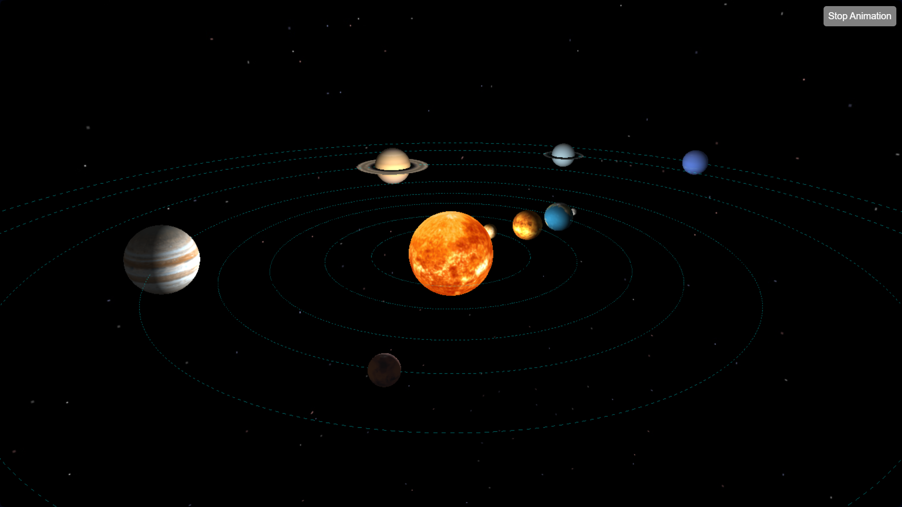

# Solar System Information Project

Welcome to the Solar System Information Project! This project aims to provide a fascinating journey through our celestial neighborhood, offering a detailed exploration of planets, the Sun, and even the Moons. You can see the result here: https://solar-system-6dddde5ce1c0.herokuapp.com/api

## Getting Started

To embark on this cosmic adventure, simply kickstart the project by running the `app.py` script.

## URLs and Routes

Here are the key routes that will guide your exploration:

- **Route "/api":** This is the heart of our project, featuring a captivating Solar System simulation. Brace yourself for a mesmerizing experience as you navigate through planets, bask in the brilliance of the Sun, and even venture to the enigmatic Moon.

- **Route "/redirect":** Delve into the intricacies of your favorite celestial objects. This page presents meticulously curated information about your selected cosmic marvel.

- **Route "/moons":** Dive deeper into the realm of planets and their companions. A beautifully crafted table awaits you, adorned with details about satellite moons. From names and diameters to orbital speeds and intriguing moon facts, this page offers a wealth of celestial knowledge.

## Setting Up the Database

To lay the groundwork for our cosmic exploration, don't forget to configure the PostgreSQL database using the `init_db.py` script. Make sure to tailor the connection details to your setup for a seamless experience.

## About the Solar System

Our project orbits around the Flask framework and is brought to life by the captivating Three.js library. The centerpiece of our endeavor is a dynamic webpage that delivers an immersive Solar System simulation. This virtual journey allows you to handpick celestial bodies and uncover their hidden secrets through detailed information pages.🌌🪐🚀

